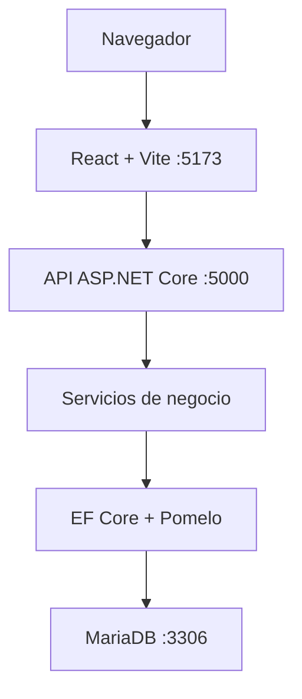

# VendeMás

VendeMás es un sistema web de punto de venta (POS) para registrar productos,
clientes, movimientos de inventario y ventas. El frontend está construido con
React y consume una API REST desarrollada con ASP.NET Core. La información se
persiste en MariaDB mediante Entity Framework Core y Pomelo.

> Estado actual: POS web funcional con consulta de productos y registro de
> ventas conectado a MariaDB, documentado y validado mediante GitHub Actions.
> La tienda virtual forma parte del alcance futuro.

## Funcionalidades implementadas

- API REST para administrar productos y clientes.
- API REST para consultar, alertar y ajustar inventario.
- Registro transaccional de ventas y sus partidas.
- Descuento automático de existencias por venta.
- Interfaz POS con búsqueda, categorías, carrito y métodos de pago.
- Navegación con layout compartido y rutas independientes por módulo.
- Manejo uniforme de errores, CORS, OpenAPI y Swagger UI.
- Credenciales locales protegidas mediante .NET User Secrets.
- Compilación automática de backend y frontend mediante GitHub Actions.

El flujo implementado actualmente es la nueva venta. Las pantallas
administrativas ya cuentan con navegación y componentes separados, pero sus
operaciones, la autenticación, el escáner y la configuración de sucursales están
identificadas como trabajo futuro en el [Roadmap](docs/ROADMAP.md).

## Arquitectura general



El frontend utiliza el proxy de Vite para enviar las rutas `/api` al backend.
Los controladores delegan las reglas de negocio a servicios y estos utilizan el
`AppDbContext` para acceder a MariaDB.

Consulta la descripción completa en [Arquitectura](docs/ARCHITECTURE.md).

## Estructura del repositorio

```text
vende-mas-sistema/
├── Backend/       API REST, reglas de negocio y persistencia
├── frontend/      Interfaz POS desarrollada con React
├── .github/       Integración continua con GitHub Actions
├── docs/          Documentación técnica y evidencia
├── vendemas.slnx  Solución de .NET
└── README.md      Descripción principal
```

## Requisitos

- .NET SDK 10.0.302 o compatible con `net10.0`.
- Node.js 24.18.0 y npm 11.16.0 o versiones compatibles.
- MariaDB 11.8 disponible en `localhost:3306`.
- `dotnet-ef` 9.0.18 para administrar migraciones.
- Git 2.55 o posterior recomendado.

Las versiones declaradas por el proyecto se encuentran en
[Stack tecnológico](docs/TECH-STACK.md).

## Configuración local

### 1. Configurar MariaDB

Crea la base `vendemasdb` y un usuario con permisos sobre ella. Desde la raíz
del repositorio registra la cadena de conexión sin guardarla en Git:

```powershell
dotnet user-secrets set "ConnectionStrings:DefaultConnection" `
  "Server=localhost;Port=3306;Database=vendemasdb;User=Admin;Password=TU_CLAVE;" `
  --project .\Backend\Backend.csproj
```

Aplica las migraciones:

```powershell
dotnet ef database update `
  --project .\Backend\Backend.csproj `
  --startup-project .\Backend\Backend.csproj
```

### 2. Ejecutar el backend

```powershell
dotnet restore .\Backend\Backend.csproj
dotnet run --project .\Backend\Backend.csproj
```

- API: `http://localhost:5000`
- Salud: `http://localhost:5000/api/health`
- Swagger UI: `http://localhost:5000/swagger/index.html`

### 3. Ejecutar el frontend

En otra terminal:

```powershell
cd frontend
npm install
npm run dev
```

Abre `http://localhost:5173`.

## Documentación

| Documento | Contenido |
| --- | --- |
| [Metodología](docs/METHODOLOGY.md) | Fases, entregables, seguimiento y definición de terminado |
| [Arquitectura](docs/ARCHITECTURE.md) | Componentes, capas, despliegue, datos y comunicación |
| [Stack tecnológico](docs/TECH-STACK.md) | Tecnologías, versiones y justificación |
| [Flujo Git](docs/GIT-WORKFLOW.md) | Ramas, commits, Pull Requests y estrategia de integración |
| [Evidencia](docs/EVIDENCE.md) | Validaciones y trazabilidad del desarrollo |
| [Roadmap](docs/ROADMAP.md) | Funcionalidad actual y próximos incrementos |
| [Lista de entrega](docs/RELEASE-CHECKLIST.md) | Preparación y publicación de una versión estable |
| [Backend](Backend/README.md) | Configuración y endpoints de la API |

## Flujo de contribución

El proyecto utiliza un Git Flow simplificado:

1. `main` conserva versiones estables.
2. `develop` integra el trabajo completado.
3. Cada cambio se desarrolla en una rama `feature/SPRINTx-yy-descripcion`.
4. Los cambios entran a `develop` mediante Pull Request revisado.
5. Una versión validada pasa de `develop` a `main` mediante Pull Request.

Los detalles y comandos están en [Flujo Git](docs/GIT-WORKFLOW.md).

## Seguridad

- Las contraseñas no se almacenan en `appsettings.json`.
- Los secretos de desarrollo se administran con .NET User Secrets.
- `.gitignore` excluye `node_modules`, `dist`, `bin`, `obj` y archivos locales.
- Las operaciones de venta se ejecutan dentro de una transacción.

## Autor

Roberto Gabriel Ángel Díaz - Proyecto académico, mayo-agosto de 2026.
