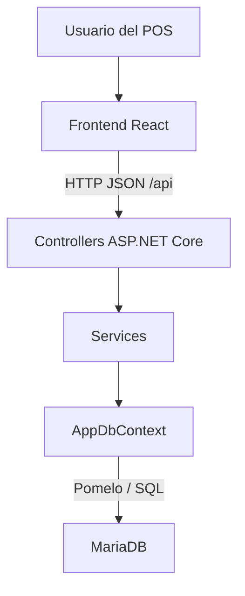
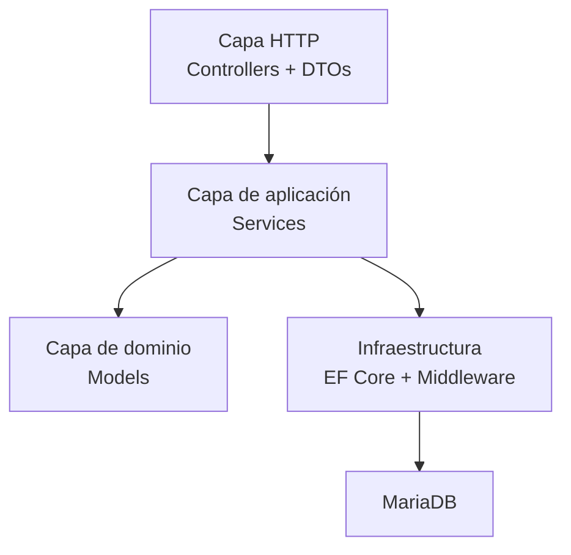
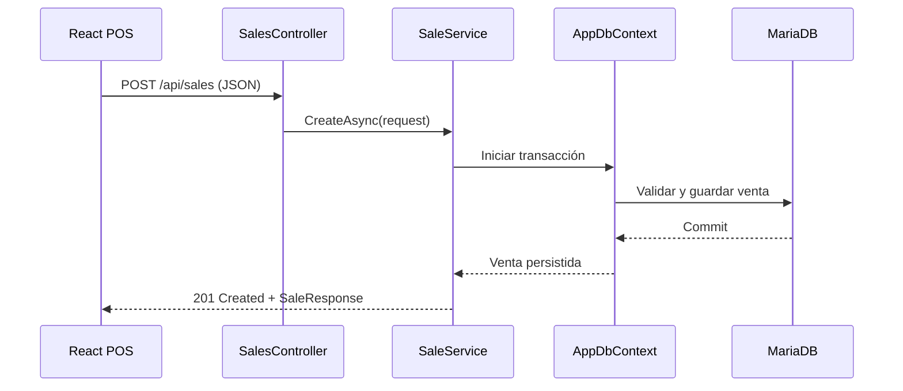
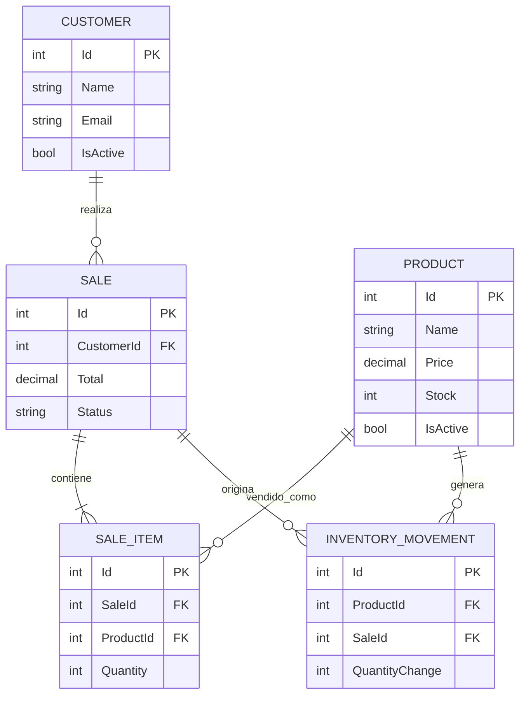
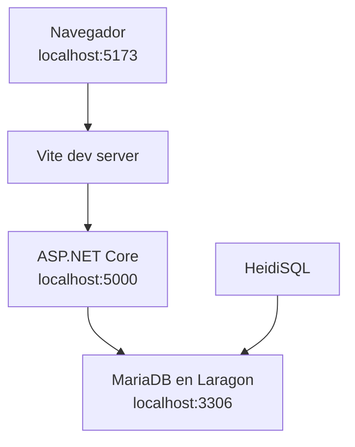

# Arquitectura del sistema

## Visión general

VendeMás sigue una arquitectura cliente-servidor con separación por capas. El
frontend presenta el POS y administra el estado de la interacción. El backend
expone la API y concentra validación, reglas de negocio y persistencia. MariaDB
almacena el estado definitivo.

## Componentes y responsabilidades

| Componente | Responsabilidad |
| --- | --- |
| React | Renderizar productos, categorías, carrito, cobro y estados de error |
| React Router | Asociar cada módulo del menú con una ruta independiente |
| Layout y páginas | Compartir navegación sin mezclarla con la lógica del punto de venta |
| Módulos `api` | Centralizar las solicitudes HTTP y transformar errores de la API |
| Hook `useProducts` | Cargar y volver a consultar productos sin acoplar HTTP a la vista |
| Controllers | Definir rutas, códigos HTTP y contratos públicos |
| DTOs | Validar y delimitar datos de entrada y salida |
| Services | Ejecutar reglas de productos, clientes, inventario y ventas |
| Middleware | Convertir excepciones controladas en Problem Details |
| AppDbContext | Mapear entidades, relaciones, índices y precisión decimal |
| MariaDB | Mantener datos persistentes y restricciones relacionales |

## Separación del backend

Los controladores no acceden directamente a la base. Los servicios reciben los
DTOs, aplican reglas y utilizan `AppDbContext`. Esto reduce el acoplamiento y
permite mantener las reglas fuera de la presentación y del transporte HTTP.

## Comunicación frontend-backend

Durante desarrollo, el navegador solicita rutas relativas como
`/api/products`. Vite escucha en el puerto 5173 y reenvía `/api` hacia
`http://localhost:5000`. El backend también permite el origen del frontend
mediante la política CORS `Frontend`.

## Modelo de datos

Una venta puede asociarse a un cliente o utilizar público general. Cada venta
contiene una o más partidas. Una partida conserva nombre y precio del producto
al momento de vender, mientras que el movimiento registra existencia anterior,
nueva existencia y motivo.

## Despliegue de desarrollo

| Puerto | Servicio | Uso |
| --- | --- | --- |
| 5173 | Vite | Interfaz React y proxy `/api` |
| 5000 | ASP.NET Core | API REST, OpenAPI y Swagger UI |
| 3306 | MariaDB | Persistencia local |

## Decisiones de diseño

- **API REST y JSON:** integración simple con React y Swagger.
- **Servicios con interfaces:** separan reglas de los controladores.
- **DTOs:** evitan exponer directamente las entidades persistentes.
- **Transacciones:** una venta y su inventario se confirman o cancelan juntos.
- **Migraciones:** el esquema se reproduce de forma versionada.
- **User Secrets:** la contraseña permanece fuera del repositorio.
- **Proxy de Vite:** evita codificar la URL del backend en cada componente.
- **Rutas y layout compartido:** separan la navegación de las pantallas y
  permiten implementar cada módulo en una rama independiente.

## Alcance actual y futuro

La implementación actual cubre el POS web local y la navegación entre módulos.
Las operaciones administrativas de productos, clientes, ventas y ajustes se
presentan como alcance próximo. La tienda virtual, autenticación, despliegue
productivo y funcionamiento offline permanecen como trabajo futuro y no se
presentan como funcionalidades terminadas.
