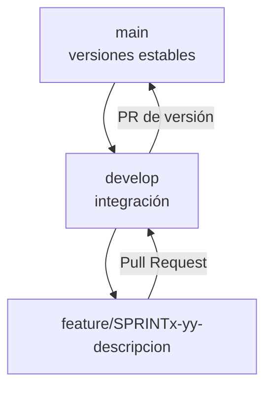

# Flujo de trabajo con Git

## Modelo de ramas

El repositorio utiliza un **Git Flow simplificado**. Las ramas permanentes son
`main` y `develop`; las ramas temporales nacen desde `develop` y regresan a ella
mediante Pull Request.



| Rama | Duración | Propósito |
| --- | --- | --- |
| `main` | Permanente | Conservar entregas estables |
| `develop` | Permanente | Integrar incrementos completados |
| `feature/SPRINTx-yy-descripcion` | Temporal | Desarrollar una funcionalidad o entregable |
| `fix/descripcion` | Temporal | Corregir un defecto aislado |
| `docs/descripcion` | Temporal opcional | Realizar un cambio exclusivamente documental |

## Reglas

- No realizar commits funcionales directamente en `main` o `develop`.
- Crear ramas temporales desde `develop` actualizado.
- Mantener cada rama enfocada en un único objetivo.
- No versionar secretos ni archivos generados.
- Integrar mediante Pull Request con descripción y validaciones.
- Exigir que `Backend build` y `Frontend build` terminen correctamente.
- Crear el PR de una característica con base `develop`.
- Llevar `develop` a `main` únicamente como versión validada.

## Inicio de una tarea

```powershell
git switch develop
git pull --ff-only origin develop
git switch -c feature/SPRINT3-01-project-documentation
git branch --show-current
```

## Convención de commits

Se utiliza Conventional Commits con mensajes breves en infinitivo:

```text
tipo(alcance): descripción
```

| Tipo | Uso | Ejemplo |
| --- | --- | --- |
| `feat` | Nueva funcionalidad | `feat(frontend): integrar ventas con API` |
| `fix` | Corrección | `fix(inventory): validar existencias negativas` |
| `docs` | Documentación | `docs(project): documentar arquitectura y flujo Git` |
| `chore` | Configuración o mantenimiento | `chore(repo): actualizar gitignore` |
| `refactor` | Mejora interna sin cambiar comportamiento | `refactor(api): separar lógica de productos` |
| `test` | Pruebas | `test(sales): validar cálculo de totales` |

Evitar mensajes genéricos como `cambios`, `listo`, `actualización` o
`correcciones` sin alcance.

## Preparación y publicación

```powershell
git status --short
git diff --check
git add README.md Backend/README.md docs
git commit -m "docs(project): documentar metodología y arquitectura"
git push -u origin feature/SPRINT3-01-project-documentation
git status
```

Antes del commit se deben ejecutar las validaciones relacionadas con el cambio.
Para código del proyecto:

```powershell
dotnet build .\Backend\Backend.csproj
cd frontend
npm ci
npm run build
```

## Pull Requests

Cada PR debe contener:

- Título con formato de commit convencional.
- Resumen de lo que cambia.
- Lista de validaciones realizadas.
- Declaración de seguridad cuando maneje configuración o credenciales.
- Base `develop` para funcionalidades.
- Estado Draft mientras falten criterios de aceptación.
- Controles automáticos de backend y frontend en estado exitoso.

Ejemplo de descripción:

```markdown
## Resumen

- Documenta metodología, arquitectura, stack y flujo Git.
- Alinea el README con la implementación actual.

## Validación

- [x] Enlaces internos revisados.
- [x] Diagramas Mermaid renderizan en GitHub.
- [x] Documentación consistente con el código.
```

## Estrategia de integración

1. Abrir PR desde la rama temporal hacia `develop`.
2. Mantenerlo como Draft mientras el incremento esté incompleto.
3. Marcarlo Ready for review después de validar.
4. Resolver conflictos y observaciones.
5. Confirmar que todos los controles de GitHub Actions estén en verde.
6. Utilizar **Merge pull request** para conservar el contexto del PR.
7. Actualizar la copia local de `develop` con `git pull --ff-only`.
8. Eliminar la rama temporal cuando ya no sea necesaria.

La integración de `develop` a `main` requiere un PR separado de versión. No se
crea automáticamente después de cada característica.

## Evidencia del flujo aplicado

| PR | Resultado | Evidencia |
| --- | --- | --- |
| [#2](https://github.com/GabrielAngel19/vende-mas-sistema/pull/2) | API POS y MariaDB fusionados a `develop` | Resumen, tres commits y validaciones |
| [#4](https://github.com/GabrielAngel19/vende-mas-sistema/pull/4) | React integrado con la API y fusionado a `develop` | Un commit y validación funcional |
| [#5](https://github.com/GabrielAngel19/vende-mas-sistema/pull/5) | Documentación del proyecto fusionada a `develop` | Rúbrica, diagramas y Markdown validados |
| [#6](https://github.com/GabrielAngel19/vende-mas-sistema/pull/6) | Integración continua fusionada a `develop` | `Backend build` y `Frontend build` exitosos |
| [#1](https://github.com/GabrielAngel19/vende-mas-sistema/pull/1) | Cerrado sin fusionar | Se corrigió el destino incorrecto `main` |
| [#3](https://github.com/GabrielAngel19/vende-mas-sistema/pull/3) | Cerrado sin fusionar | Se eliminó una solicitud duplicada |

Este historial demuestra que el repositorio aplica el flujo documentado y que
los errores de integración se corrigen sin alterar las ramas permanentes.

## Protección de ramas

Las ramas `main` y `develop` deben estar cubiertas por un ruleset activo con
estas reglas:

- Impedir eliminaciones y actualizaciones forzadas.
- Exigir Pull Request antes de fusionar.
- Exigir los controles `Backend build` y `Frontend build`.
- Mantener la rama del PR actualizada antes de fusionar.

Como el proyecto es individual, la aprobación obligatoria de otra persona se
mantiene desactivada. El docente puede agregarse como revisor cuando corresponda.

La reconciliación inicial entre la versión antigua de `main` y el contenido
actual de `develop` está descrita en
[RELEASE-CHECKLIST.md](RELEASE-CHECKLIST.md).
