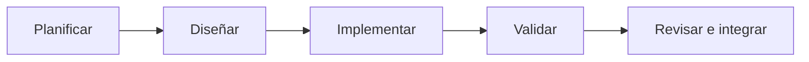

# Metodología de desarrollo

## Enfoque seleccionado

VendeMás utiliza **Scrum adaptado a un proyecto académico individual**, con
iteraciones cortas orientadas a entregar incrementos verificables. Git y GitHub
registran el seguimiento: cada incremento se desarrolla en una rama de sprint,
se valida localmente y se integra mediante un Pull Request hacia `develop`.

La duración de una iteración depende del entregable, pero todas conservan el
mismo ciclo:

## Roles

| Rol | Responsable | Responsabilidad |
| --- | --- | --- |
| Product Owner | Autor del proyecto | Priorizar necesidades del POS y aceptar entregables |
| Desarrollador | Autor del proyecto | Diseñar, programar, documentar y probar |
| Revisor | Docente y revisión del Pull Request | Verificar rúbrica, calidad y consistencia |

En este proyecto una misma persona cubre los roles de Product Owner y
desarrollador. La separación se conserva conceptualmente para distinguir la
priorización del producto de la ejecución técnica.

## Fases de cada sprint

### 1. Planificación

- Definir el objetivo y el criterio de aceptación.
- Seleccionar un conjunto pequeño de tareas relacionadas.
- Actualizar `develop` y crear una rama `feature/SPRINTx-yy-descripcion`.

### 2. Diseño

- Identificar componentes, contratos, datos y riesgos.
- Mantener las decisiones alineadas con la arquitectura documentada.
- Evitar credenciales o archivos generados dentro del repositorio.

### 3. Implementación

- Realizar cambios pequeños y coherentes.
- Utilizar commits convencionales (`feat`, `fix`, `docs`, `chore`, etc.).
- Mantener separadas la presentación, API, negocio y persistencia.

### 4. Validación

- Compilar backend y frontend.
- Probar endpoints desde Swagger.
- Verificar persistencia y relaciones en HeidiSQL.
- Probar la operación desde la interfaz React cuando aplique.
- Ejecutar `git status` para impedir archivos generados o secretos.

### 5. Revisión e integración

- Publicar la rama y abrir un Pull Request hacia `develop`.
- Documentar resumen y pruebas realizadas.
- Corregir conflictos o hallazgos.
- Fusionar únicamente cuando los criterios de aceptación estén completos.

## Artefactos y entregables

| Artefacto | Uso en VendeMás |
| --- | --- |
| Product Backlog | Funcionalidades pendientes del POS y tienda virtual futura |
| Sprint Backlog | Objetivo expresado por la rama y tareas del incremento |
| Incremento | Código y documentación compilados y probados |
| Pull Request | Evidencia de revisión, validación e integración |
| Migraciones | Historial versionado del esquema de MariaDB |
| Documentación | Arquitectura, stack, flujo Git y evidencia |

## Historial de iteraciones

| Iteración | Objetivo | Resultado | Evidencia |
| --- | --- | --- | --- |
| Sprint 1 | Inicializar repositorio, frontend y backend | Estructura base y ramas permanentes | Historial de `main` y `develop` |
| Sprint 2.1 | Crear API y persistencia | Productos, clientes, inventario, ventas y MariaDB | [PR #2](https://github.com/GabrielAngel19/vende-mas-sistema/pull/2) |
| Sprint 2.2 | Integrar React con la API | Productos reales, carrito, venta y actualización de stock | [PR #4](https://github.com/GabrielAngel19/vende-mas-sistema/pull/4) |
| Sprint 3.1 | Consolidar documentación | Documentación alineada con el sistema real | Rama `feature/SPRINT3-01-project-documentation` |

Los PR #1 y #3 se cerraron sin fusionar al detectar un destino incorrecto o una
solicitud duplicada. Esta corrección preservó el modelo de ramas documentado.

## Definición de terminado

Una tarea está terminada cuando:

- Cumple su criterio funcional.
- Backend y frontend compilan cuando son afectados.
- La operación principal fue probada.
- Los datos persisten correctamente cuando corresponde.
- No incluye secretos, `node_modules`, `dist`, `bin` u `obj`.
- La documentación coincide con el cambio.
- Existe un commit descriptivo y un Pull Request hacia `develop`.

## Seguimiento

El avance se puede auditar mediante:

- Nombres de ramas asociados a cada sprint.
- Commits convencionales.
- Pull Requests con resumen y lista de validación.
- Migraciones de Entity Framework Core.
- Evidencias técnicas registradas en [EVIDENCE.md](EVIDENCE.md).
